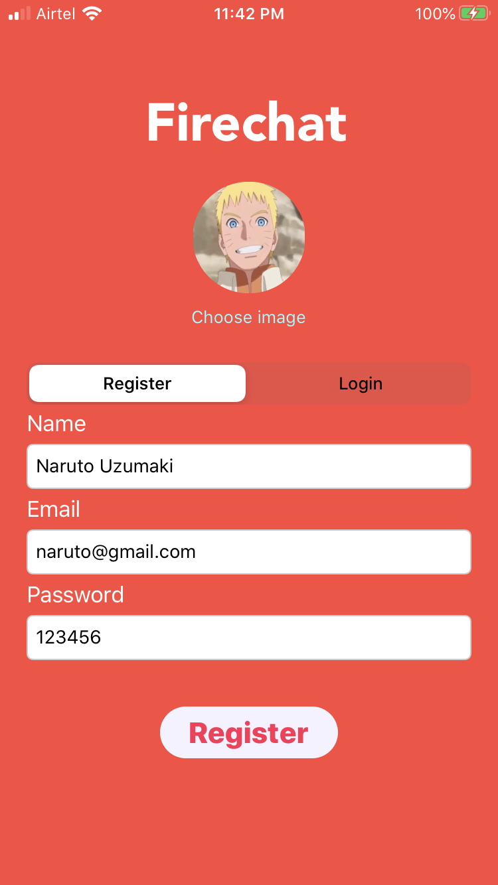
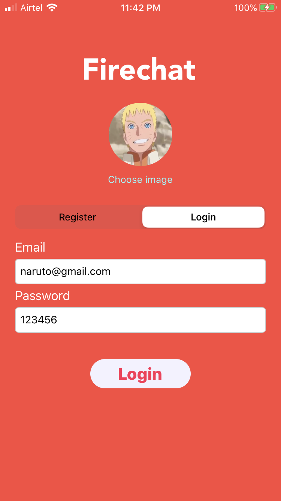
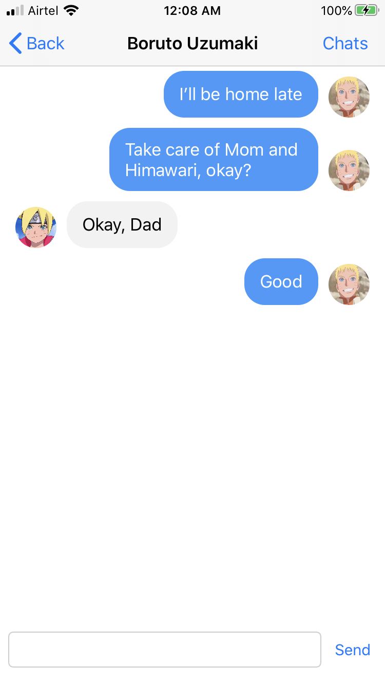
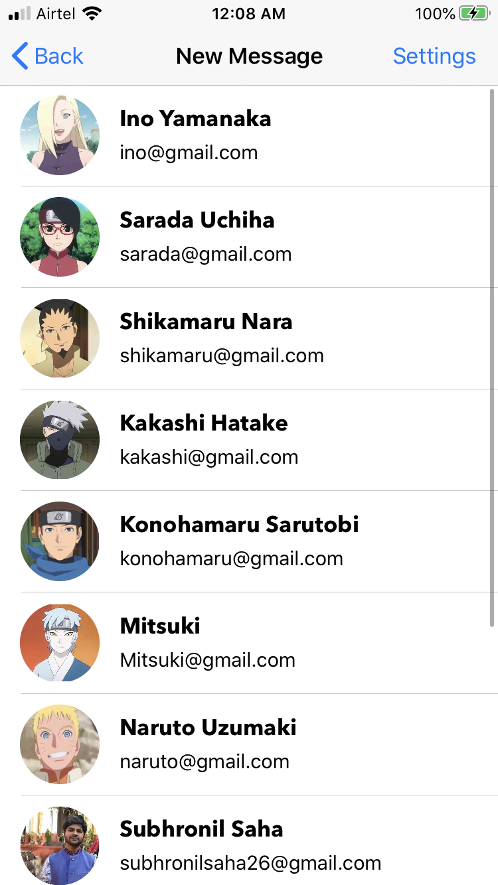

# Firechat (v. 1)

Cloud based instant messaging app for iOS.

## Overview

Firechat is a simple cloud based messaging service for iOS, which stores and fetches data from the Firebase servers. User authentication and Media storage are also being handled By Firebase. 

## Usage

1. Clone the repository to your system. 
2. Open ```Firechat.xcworkspace```
3. Run the app on your Apple device or Simulator. 

## Screenshots


Some screenshots with dummy users (from Naruto :D)

#### Register screen



#### Login screen



#### Chat screen



#### New Messages List



###### P.S. - UI Improvements in progress
